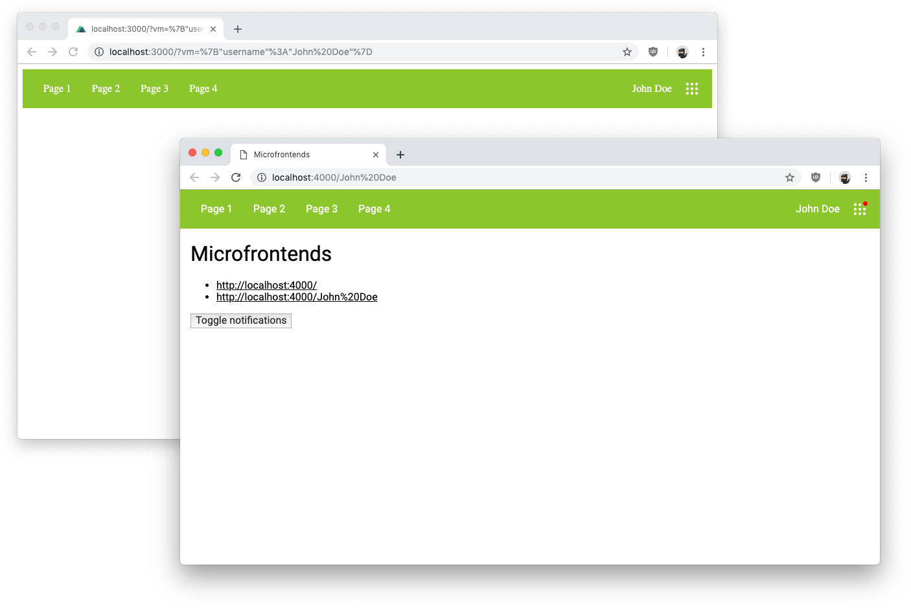

# Microfrontends

A simple microfrontend architecture for explaining/showcasing the concept



## Setup

### Microfrontend

```bash
cd microfrontend
npm install
npm start
```

This will serve a microfrontend at <http://localhost:3000/>, which you can open in the browser but it won’t do a lot on its own.

### Application

```bash
cd application
npm install
npm start
```

Open <http://localhost:4000/> in your browser, try to change the microfrontend’s view model via <http://localhost:4000/John%20Doe> and toggle notifications.

There’s also a <http://localhost:4000/single-page-application> route that shows how to use microfrontends within a single-page application when there’s no possibility for server-side includes.

## Contributors

Manuel Wieser<br>
<https://manu.ninja><br>
<https://twitter.com/manuelwieser><br>
<https://www.paypal.me/manuninja><br>
